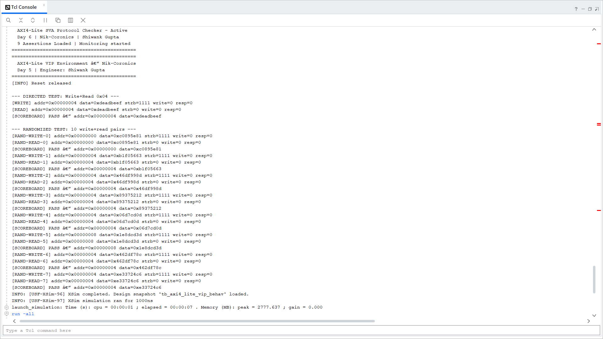
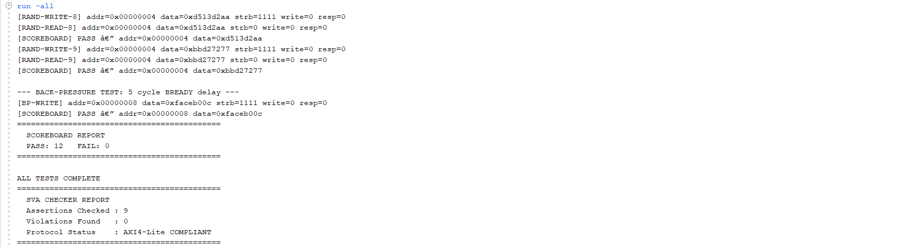

# Day 6 — SVA Protocol Checker

**7-Days AMBA AXI4-Lite Protocol Sprint | Nik-Coronics — Independent R&D**
**Engineer:** Shiwank Gupta · **Date:** 01 July 2026

---

## 🎯 Objective

Build a **SystemVerilog Assertion (SVA) Protocol Checker** — 9 concurrent assertions that automatically monitor every AXI4-Lite signal on every clock edge and flag protocol violations the moment they occur, without any manual test intervention.

---

## 📐 SVA vs Testbench Checker — The Core Difference


```
Testbench Checker (Day 4):
  if (RDATA === expected) → PASS
  else → FAIL

  Problem: Only catches what YOU explicitly wrote tests for.
           Silent bugs pass through undetected.

SVA Concurrent Assertion:
  Checks on EVERY clock edge — automatically, forever.
  No manual triggering. No test required.
  Catches violations the testbench never saw.

Example:
  AWVALID drops before AWREADY arrives →
  Testbench: RDATA matched → PASS  (missed it)
  SVA:       Drop Rule fires → VIOLATION caught
```

---

## 📐 Drop Rule — SVA Assertion 1


The Drop Rule is the most critical AXI4-Lite handshake constraint:
once VALID goes HIGH, it must stay HIGH until READY arrives.

```systemverilog
property aw_drop_rule;
    @(posedge ACLK) disable iff (!ARESETn)
    (AWVALID && !AWREADY) |-> ##1 AWVALID;
endproperty
assert property (aw_drop_rule)
    else $error("[SVA] AW Drop Rule violated!");
```

---

## 📐 9 Assertions — Complete Summary


| # | Assertion | Rule |
|---|---|---|
| 1 | AW Drop Rule | AWVALID must hold until AWREADY |
| 2 | W Drop Rule | WVALID must hold until WREADY |
| 3 | BVALID Hold | BVALID must hold until BREADY |
| 4 | No Deadlock | AWREADY only rises when AWVALID is HIGH |
| 5 | BRESP = OKAY | BRESP must be 2'b00 on normal transactions |
| 6 | AR Drop Rule | ARVALID must hold until ARREADY |
| 7 | RVALID Hold | RVALID must hold until RREADY |
| 8 | RRESP = OKAY | RRESP must be 2'b00 on normal transactions |
| 9 | Reset Check | All VALID signals must be LOW during reset |

---

## 📐 Key SVA Syntax

```systemverilog
// Implication operators
A |-> B        // If A, then B same cycle
A |-> ##1 B    // If A, then B next cycle

// Disable during reset (critical — prevents false violations)
disable iff (!ARESETn)

// Edge detection
$rose(signal)   // 0→1 transition
$fell(signal)   // 1→0 transition

// Assert vs Cover
assert property (p) else $error("violation!");  // catches bad things
cover  property (p);                             // confirms good things happened
```

---

## ✅ Simulation Results — Vivado XSim

**Console Output — SVA Checker Active:**



**Final Scoreboard + SVA Report:**



```
============================================
  AXI4-Lite SVA Protocol Checker - Active
  Day 6 | Nik-Coronics | Shiwank Gupta
  9 Assertions Loaded | Monitoring started
============================================

  SCOREBOARD REPORT
  PASS: 12   FAIL: 0

  SVA CHECKER REPORT
  Assertions Checked : 9
  Violations Found   : 0
  Protocol Status    : AXI4-Lite COMPLIANT
============================================
```

**Waveform — All 5 Channels + SVA Checker:**


---

## 🔑 Key Learnings

```
1. SVA = always-on protocol guardian
   Testbench = test-specific checker
   Both needed — complementary roles, not replacements.

2. disable iff (!ARESETn) is critical
   Without it, assertions fire during reset and give
   false violations — always include this.

3. ##1 = next clock cycle
   |-> = overlapping implication
   These two operators cover the majority of AXI4 protocol rules.

4. cover property ≠ assert property
   assert = catches violations  (bad things must NOT happen)
   cover  = confirms coverage   (good things MUST happen)

5. BRESP/RRESP = 2'b00 (OKAY) for all normal transactions
   Any other value = error condition in AXI4-Lite.

6. SVA can be synthesized for formal verification
   Not just simulation — used in real chip sign-off flows.

7. Tool limitation documented:
   XSim (Vivado) supports concurrent assertions ✅
   XSim does NOT support cover properties ⚠️
   QuestaSim/VCS needed for full SVA + coverage flow.
```

---

## 📁 Files In This Folder

| File | Description |
|---|---|
| `axi4_lite_checker.sv` | 9 SVA assertions + 5 cover properties |
| `notes.md` | Theory, syntax reference, assertion explanations |
| `readme.md` | This file — Day 6 full documentation |
| `DROP RULE.jpg` | Hand-drawn SVA timing diagram |
| `SVA ASSERTIONS.jpg` | Hand-drawn 9-assertion summary table |
| `SVA vs TESTBENCH CHECKER.jpg` | Hand-drawn concept comparison |
| `console1.png` | Simulation console — checker startup |
| `console2.png` | Simulation console — final SVA report |
| `waveform upper.png` | Vivado waveform — GLOBAL + AW/W/B channels |
| `waveform lower.png` | Vivado waveform — AR/R + SVA checker signals |

---

## 📅 What's Next — Day 7 (Final)

```
Day 7: Functional Coverage + Regression + Sprint Sign-off
├── Covergroups — define measurement buckets
├── Cross-coverage — addr × data combinations
├── Regression suite — run all days together
└── Final sprint summary post
```

---

## 📊 Sprint Progress

| Day | Topic | Status |
|---|---|---|
| Day 0 | Foundation — AMBA family, blueprint | ✅ |
| Day 1 | Handshake Mechanics | ✅ |
| Day 2 | 5-Channel Architecture | ✅ |
| Day 3 | RTL — 301 MHz synthesis (Cyclone V) | ✅ |
| Day 4 | Testbench — 8/8 directed tests PASS | ✅ |
| Day 5 | VIP + Master BFM — 12/12 tests PASS | ✅ |
| Day 6 | SVA Protocol Checker — 9 assertions, 0 violations | ✅ |
| Day 7 | Coverage + Regression + Sign-off | ⬜ Tomorrow |

---

*Shiwank Gupta | Nik-Coronics | VLSI R&D*